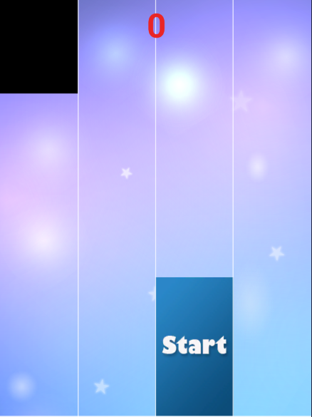
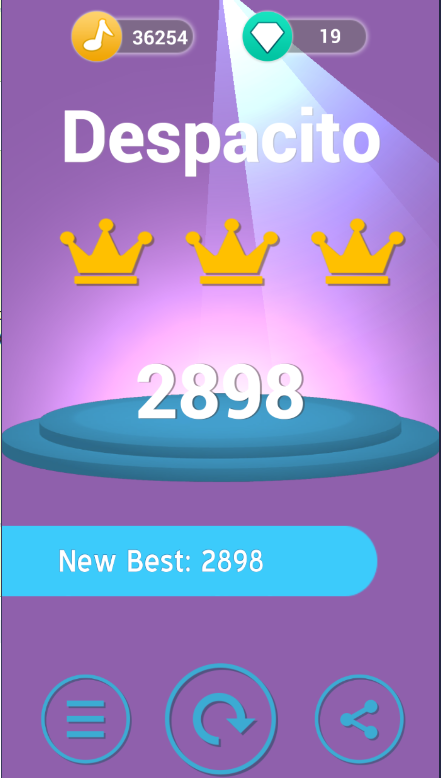
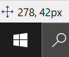

# Bot-Piano-Tiles

Bot to play Piano Tiles:

You can get really high scores using this code:

You may need to adjust pixel location manually.

An easy way to find the pixels of interest: take a screenshot and paste it on Paint
The pixel coordinate will be in the bottom left.

